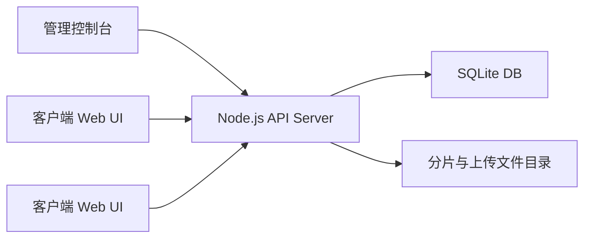
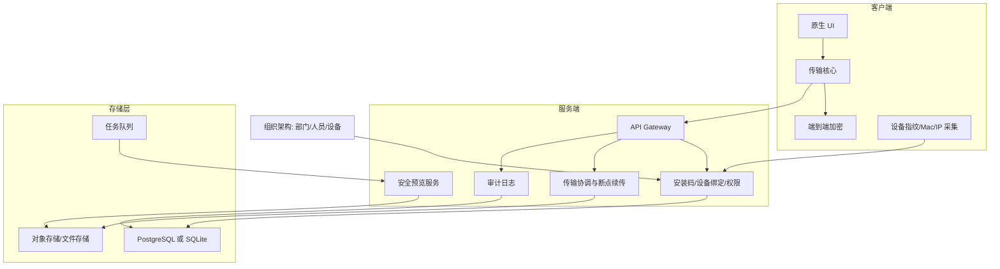

# 架构与技术选型

## 目标

先交付一个能演示和迭代的文件助手，然后逐步增强到企业生产级系统。核心方向是：

- 客户端小体积、低资源占用。
- Windows 和 macOS 跨平台。
- 支持 Win7/8/10/11/Windows Server 兼容策略。
- 支持 Intel Mac 和 Apple Silicon。
- 端到端安全传输、大文件优化、断点续传。
- 管理端可做可选中转确认、重要备份、审计和基础设备管控。

## 当前原型

当前实现刻意保持零第三方依赖，便于快速启动和演示：

- HTTP API：Node.js 内置 `http`。
- 数据存储：Node 内置 SQLite，默认文件为 `data/file-assistant.sqlite`。
- 管理登录：管理员账号密码、PBKDF2 密码哈希、12 小时会话 token。
- 组织架构：部门、人员、客户端设备绑定。
- 发送规则：按发送部门/接收部门控制是否允许中转、是否需要中转确认、是否允许重要备份。
- 文件上传：分片 PUT，服务端合并。
- 文件流转：默认临时中转，接收端确认接收后服务端清除；重要备份才保留。
- UI：原生 HTML/CSS/JavaScript。

## 生产目标架构

## 客户端选型建议

### 现代系统客户端

适用范围：

- Windows 10/11/较新的 Windows Server。
- macOS Intel。
- macOS Apple Silicon。

推荐方向：

- Rust 或 C++ 写传输核心。
- UI 可选 Qt 6、SwiftUI(macOS)、WinUI/Win32(Windows)。
- 打包时按平台生成独立安装包。

优点：

- 性能好，文件和网络控制能力强。
- 客户端体积可控。
- 方便做断点续传、并发分片、加密、设备绑定、防截屏策略。

注意：

- Tauri/WebView 路线体积小，但旧系统兼容性受 WebView2 限制。
- 纯 Electron 兼容和开发效率好，但体积通常偏大，不适合“客户端越小越好”的目标。

### Win7/8 Legacy 客户端

Win7/8 不建议和现代客户端强行共用同一套 GUI 技术栈。建议独立 legacy 版本：

- C++/Qt 5.15 或 Win32 原生 UI。
- 传输核心复用协议设计，但编译链固定在支持旧系统的版本。
- 功能优先保证安装、注册、传输、续传、日志上报。
- 防截屏、现代沙箱能力按系统能力降级。

原因：

- Rust 官方已宣布从 Rust 1.78 起 Windows 7/8 不再是 Tier 1 目标。
- Go 1.21 起不再支持 Windows 7/8/Server 2008/Server 2012。
- Microsoft WebView2 对 Windows 7/8 的运行时更新停在旧版本，长期安全性和可维护性不适合作为企业长期路线。

参考：

- [Rust blog: Changes to Rust's Tier 1 platform support](https://blog.rust-lang.org/2024/02/26/Windows-7/)
- [Go 1.21 Release Notes](https://go.dev/doc/go1.21)
- [Microsoft WebView2 supported platforms](https://learn.microsoft.com/en-us/microsoft-edge/webview2/concepts/distribution#supported-platforms)
- [Qt Supported Platforms](https://doc.qt.io/qt-6/supported-platforms.html)

## 安全方案

当前原型：

- 管理员令牌保护管理端 API。
- 客户端 ID + secret 保护客户端 API。
- Mac/IP 策略在服务端校验。
- 文件传输有可选中转确认和日志，但文件在服务端明文落盘。

生产版本应增强为：

- 全站 TLS。
- 客户端安装包签名。
- 安装码一次性兑换设备证书。
- 客户端私钥存入系统安全区，例如 Windows DPAPI、macOS Keychain。
- 文件在客户端加密后上传，服务端只保存密文。
- 接收端按授权获取加密密钥或密钥封装包。
- 每个文件、每个接收者独立密钥。
- 审计日志写入不可篡改存储或追加式日志。

## 大文件传输方案

当前原型：

- 默认 2 MB 分片。
- 服务端记录已上传分片。
- 同名同大小未完成任务可断点续传。
- 发送者不能从服务器取回自己上传的文件。
- 接收者只能接收发给自己的文件。
- 普通文件在接收确认后自动清除，重要备份由管理员保留或手动清除。
- 未配置发送规则时默认允许互传并免中转确认；启用规则后必须命中规则。

生产版本建议：

- 分片大小动态调整，常规 8 MB 到 64 MB。
- 并发上传多个分片。
- 每个分片单独 hash，最终文件 Merkle root 或全文件 hash 校验。
- 上传前秒传/差异检测。
- 后台队列合并与病毒扫描。
- 网络抖动自动重试、限速、暂停、恢复。

## 管控边界

当前定位：

- 我们的软件主要负责跨加密体系的文件中转、设备绑定、传输日志和重要备份。
- 客户端默认只保留“发送、接收、重要备份”主流程，不再把预览、截屏、防复制作为核心能力。
- 这些终端侧安全能力优先交给现场已有加密软件处理，避免重复建设和策略冲突。
- 规则层只保留是否允许中转、是否需要中转确认、是否允许重要备份。

后续细化：

- 部门、角色、人员、文件密级。
- 文件归档和备份留存策略。
- 中转确认的通知、分派和批量处理。
- 管理端查阅/下载能力的开关化。
- 与现场加密软件白名单、审计日志、既有流程系统做边界确认。

## 迭代路线

1. 当前原型：跑通完整业务闭环。
2. 当前已完成：SQLite、管理员登录、基础角色权限、部门/人员/设备绑定、发送规则。
3. 账户体系深化：角色、用户、中转确认、组织批量导入。
4. 原生客户端：先 Windows 10+/macOS，再 legacy Windows。
5. E2E 加密：客户端加密、密钥托管/授权。
6. 大文件优化：并发分片、hash 校验、失败重试。
7. 可选查阅：文档转换、只读预览、水印、防下载策略按现场需要再启用。
8. 企业部署：安装包、自动升级、日志导出、备份恢复、集群化。
